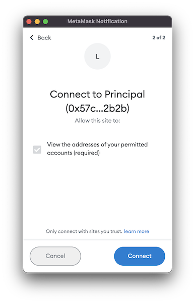
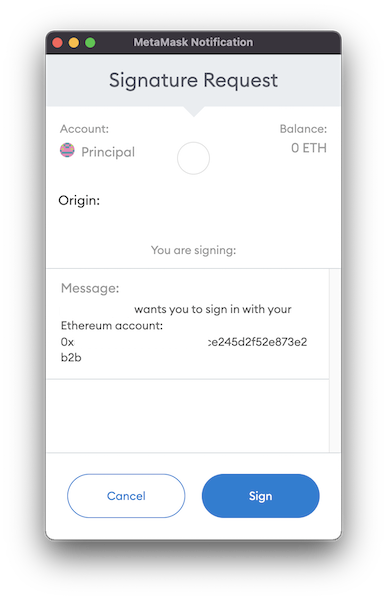

## firebase-sign-in-with-ethereum

Asynchronously signs in using an Ethereum address.

Use the ethereum address in your wallet (MetaMask) to sign the credentials used to sign in with the Firebase Auth SDK.

> Note: This strategy use the `signInWithEmailAndPassword` method of the Firebase Auth SDK.

## Install the package

Install the firebase-sign-in-with-ethereum npm module:

```sh
npm i firebase firebase-sign-in-with-ethereum
```

## Use in you project

1. Call the module `firebase-sign-in-with-ethereum` and use the `signInWithEthereum` method defined the auth instance of the Firebase SDK.

```ts
import { signInWithEthereum } from "firebase-sign-in-with-ethereum";
import { getAuth } from "firebase/auth";

const auth = getAuth();

signInWithEthereum(auth)
  .then((userCredential) => {
    // Signed in 
    const user = userCredential.user;
    // ...
  })
  .catch((error) => {
    const errorCode = error.code;
    const errorMessage = error.message;
    // ..
  });
```

2. The next step is to grant to the read address permission from your Ethereum wallet.



3. The next step is sign the message with your Ethereum wallet.




## Changelog

Can be found in [CHANGELOG](./CHANGELOG.md)

